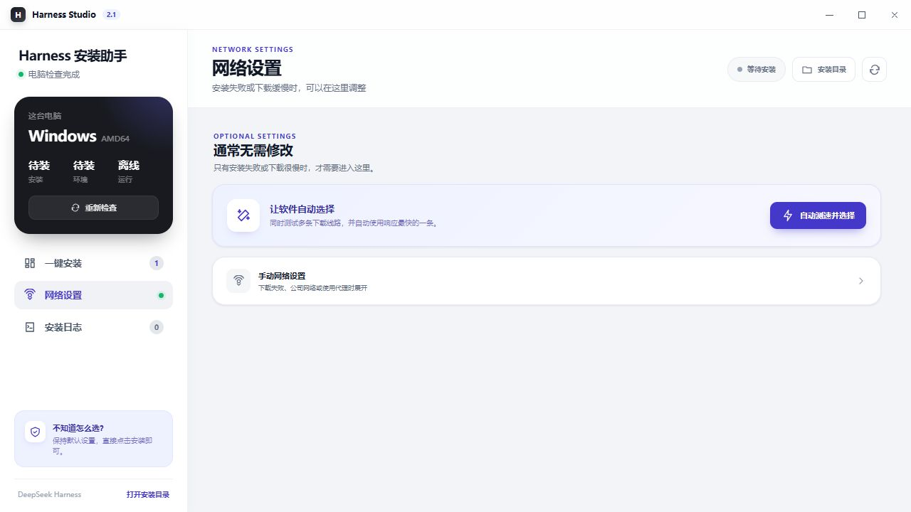
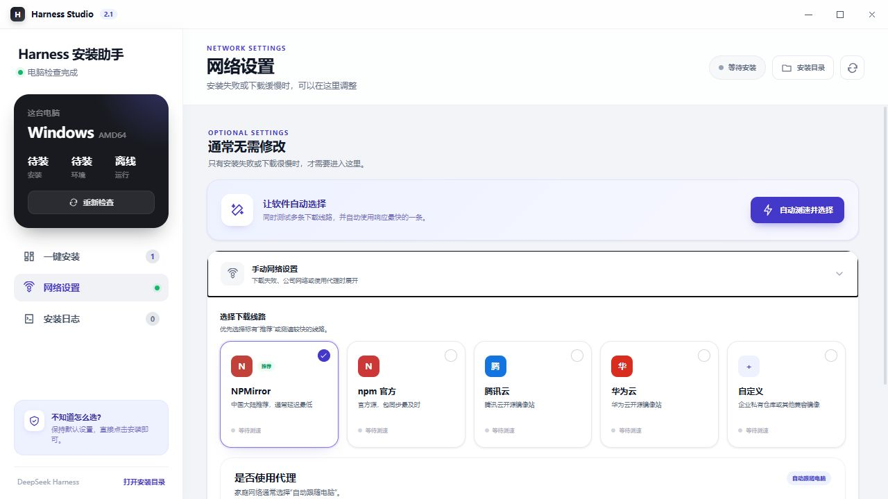

# Harness Studio

Harness Studio 是 DeepSeek Harness 的跨平台可视化部署与运行控制中心。它会自动识别当前操作系统和 CPU 架构，准备独立 Node.js 运行时，校验下载文件，并通过所选 npm 镜像完成部署。

> 本项目由社区独立开发，与 DeepSeek 官方无隶属、授权或背书关系。DeepSeek 及相关名称归其权利人所有。

## 下载

- [Windows x64 EXE](https://github.com/clen1/deepseek-harness-studio/releases/download/v2.1.0/HarnessStudio.exe)
- [Windows x64 ZIP](https://github.com/clen1/deepseek-harness-studio/releases/download/v2.1.0/HarnessStudio-2.1.0-windows-x64.zip)
- [macOS Apple Silicon（M1/M2/M3/M4）](https://github.com/clen1/deepseek-harness-studio/releases/download/v2.1.0/HarnessStudio-2.1.0-macos-arm64.zip)
- [macOS Intel](https://github.com/clen1/deepseek-harness-studio/releases/download/v2.1.0/HarnessStudio-2.1.0-macos-x64.zip)

macOS 测试包已进行临时签名，尚未使用 Apple Developer ID 完成公证。请先核对 Release 中的 SHA-256；如果系统拦截，可在“系统设置 → 隐私与安全性”中确认“仍要打开”。

## 软件截图

### 一键安装首页


### 简易网络设置



### 镜像源与代理设置



## 已实现功能

- 一键下载、校验、安装并启动 DeepSeek Harness
- 支持 Windows、macOS、Linux 的 AMD64 与 ARM64 架构
- Node.js 运行时独立存放，用户无需预装 Node
- npm 官方、NPMirror、腾讯云、华为云四个镜像预设
- 镜像并行测速、可用性检测与自定义 Registry
- 每次安装前自动选择响应最快的线路，安装失败后按测速结果自动切换并重试
- Node.js 运行时支持 NPMirror 与官方地址自动切换
- 直接连接、继承系统代理、自定义 HTTP/HTTPS 代理
- 服务启动、停止、端口检测与浏览器快捷入口
- 实时事件日志、级别筛选、搜索与复制
- 下载进度、任务取消、SHA-256 完整性校验
- 右上角提供“安装目录”快捷按钮，首页同步显示完整路径并可一键打开
- 首页提供一键卸载：自动停止由 Studio 启动的服务，移除 Harness 与内置运行环境，并保留网络和镜像设置
- 原生系统 WebView、无大型前端运行框架

## 快速构建

Windows PowerShell：

```powershell
./scripts/build-current.ps1
```

macOS 或 Linux：

```sh
chmod +x scripts/build-current.sh
./scripts/build-current.sh
```

输出文件位于 `build/bin`。跨平台桌面应用需要在对应系统上完成最终编译：Windows 生成 `.exe`，macOS 生成 `.app`，Linux 生成原生可执行文件。

仓库中的 `Build macOS` GitHub Actions 工作流会分别在 Apple Silicon 和 Intel Mac 上执行测试、构建、架构检查、临时签名与 ZIP 打包，并可把产物附加到指定 Release。

## 开发运行

需要 Go 1.21+、Node.js 15+、npm 和 Wails v2.13。首次可执行：

```sh
go install github.com/wailsapp/wails/v2/cmd/wails@v2.13.0
wails dev
```

平台依赖：

- Windows 10/11：WebView2。构建脚本会在发行文件中嵌入官方 WebView2 引导程序。
- macOS：Xcode Command Line Tools。
- Linux：GTK3 与 WebKit2GTK。Ubuntu 24.04 等使用 WebKit2GTK 4.1 的系统会自动附加 `webkit2_41` 构建标签。

## 数据位置

网络设置写入当前用户配置目录下的 `HarnessStudio/config.json`，独立运行时和 Harness 包集中存放在 `HarnessStudio/engine`。一键卸载只清理 `engine`，保留网络设置。应用只监听 Harness 自身使用的本地地址 `127.0.0.1:3080`。代理 URL 可能包含访问凭据，配置文件权限会限制为当前用户可读写。

## 性能策略

前端使用 TypeScript 与原生 DOM，生产资源压缩后约 55 KB。日志事件会在动画帧内合并更新，内存最多保留 800 条，界面最多渲染 500 条。下载采用 256 KB 流式缓冲，耗时工作全部在 Go 后台执行。

## 测试

```sh
go test ./...
```

真实部署验证会下载 Node.js 并安装 Harness，按需执行：

```powershell
$env:HARNESS_STUDIO_INTEGRATION='1'
go test -run TestRealDeployment -v
```

## 开源许可

本项目采用 [MIT License](LICENSE) 开源。项目运行时下载的第三方组件和软件包分别遵循其各自许可证。
